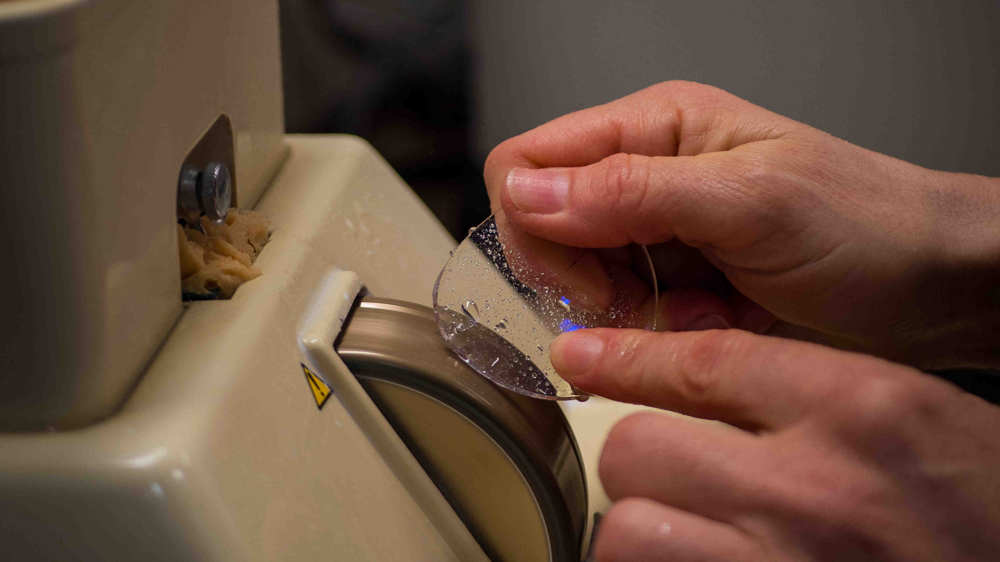


  
  


**HOYA** est un verrier japonnais fondé à Tokyo en 1941 par deux frères visionnaires.
L'entreprise est mondialement reconnue pour ses **verres de grande qualité, à la pointe de la technologie et de l'innovation**.
Elle développe des verres sur mesure adaptés à tous vos besoins.
Elle s'engage aussi pour la santé visuelle, notamment dans la lutte contre la myopie avec la gamme de verres **MiYOSMART**.

### Origine France Garantie
Implantée en France depuis plus de 20 ans, **HOYA** soutient le savoir-faire industriel de pointe français.
**HOYA** propose donc des verres **"Origine France Garantie"** fabriqués dans l'usine d'Emerainville, en Seine-et-Marne.
En plus de soutenir l'économie locale, c'est aussi la garantie d'avoir vos lunettes dans les délais les plus brefs.

### Un problème d'adaptation ?
En cas de difficultés d'adaptation à vos verres, vous pouvez bénéficier d'un échange dans les 6 mois.
**Attitude Optique** vous accompagne jusqu'au bout pour trouver les verres qui vous conviennent le mieux.

### Garantie qualité 3 ans
**HOYA** s'engage à remplacer vos verres après expertise jusqu'à trois ans après l'achat en cas de défaut au niveau des traitements.
N'hésitez pas à revenir en magasin si vous avez le moindre doute.
